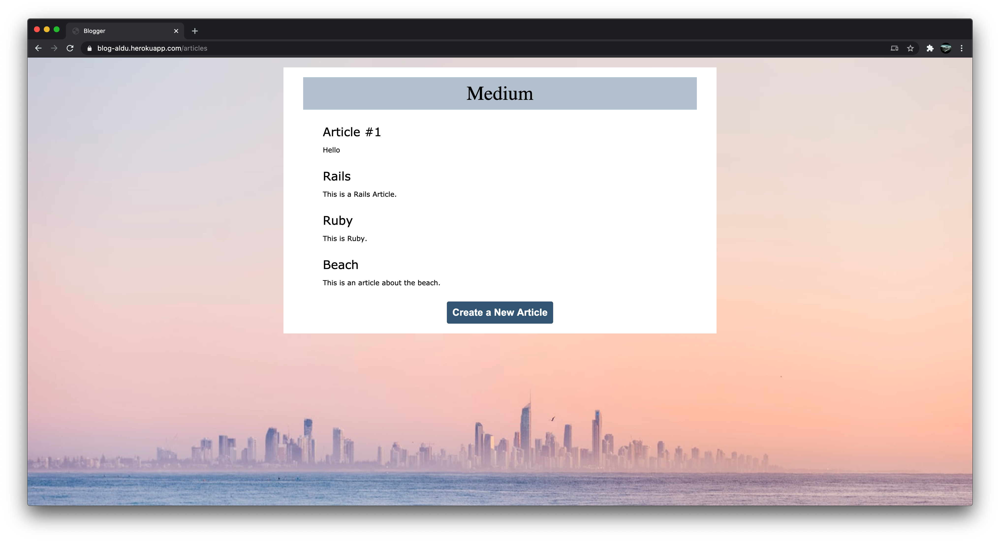

# Blog app

This is a blog application built with Ruby on Rails. 
- This app has the features of uploading images as well as posting comments.

## Tools/Languages Used

* Ruby on rails
* Heroku
* Sass
* Unsplash source API

## Blog link

[Blog app](https://blog-aldu.herokuapp.com/)

## Authors

**Muhammad Umar**
- Github: [@mohammadumar28](https://github.com/mohammadumar28)
- LinkedIn: [Mohammad Umar](https://www.linkedin.com/in/mohammadumar28/)
- Twitter: [@Mohammadumar28](https://twitter.com/Mohammadumar28)
- Email: [mohammadumar28@gmail.com](mailto:mohammadumar28@gmail.com)

**Aldana Longhi**
- Github: [@AlduLonghi](https://github.com/AlduLonghi)
- Twitter: [@AbrilLonghi](https://twitter.com/AbrilLonghi)
- Linkedin: [Aldana Abril Longhi](https://www.linkedin.com/in/aldana-abril-longhi-a842ba1a7/)
- Email [aldulonghi@gmail.com](mailto:aldulonghi@gmail.com)

## Acknowledgements

* [The Odin project](https://www.theodinproject.com/courses/ruby-on-rails/lessons/ruby-on-rails-ruby-on-rails)
* [JumpstartLab](http://tutorials.jumpstartlab.com/projects/blogger.html)
* [Microverse](https://microverse.org)

## Contribution

* Fork this repo.
* Create your feature branch `git checkout -b my-new-feature`.
* Commit your changes `git commit -am "Add some feature"`.
* Push to the branch `git push origin my-new-feature`.
* Create a new Pull Request.